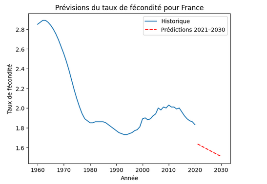
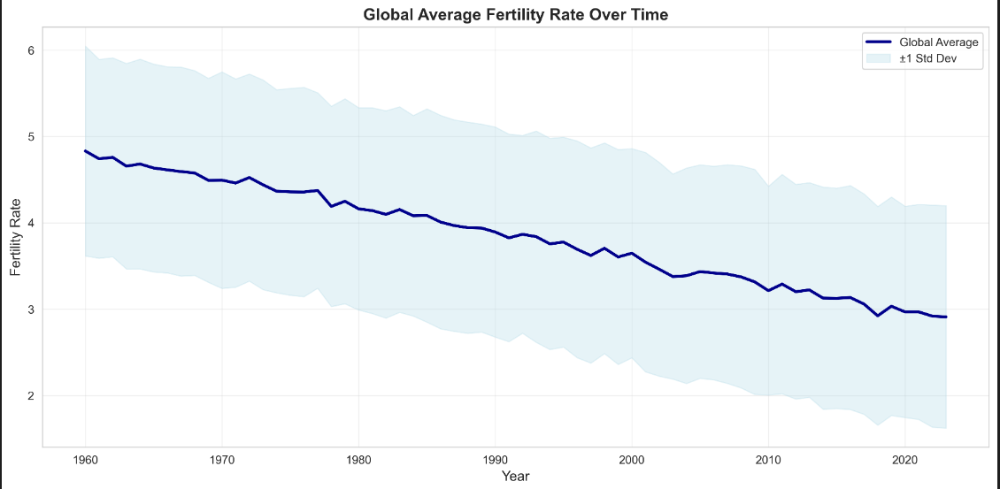

> ------------------------------------------------------------
> #  Natality-IA : Projet d'Apprentissage Artificiel  
> 
> *Réalisé par **ANTON NELCON Steve** & **CORTADA Lucas***  
> **Master 1 Informatique et Big Data – Université Paris 8**
> ------------------------------------------------------------

<div align="center">


</div>


---
> ##  SUJET  
> **Analyse et prédiction des taux de natalité mondiaux par apprentissage automatique**
>
> ##  Problématique  
> *Comment modéliser et prédire l'évolution des taux de natalité à l'échelle mondiale grâce à l'apprentissage automatique ?*  
> *Peut-on identifier des profils de pays similaires selon leurs tendances démographiques ?*


## → Présentation du projet:

**Natality-IA** est un projet en apprentissage artificiel développé dans le cadre du Master Informatique et Big Data.  
Il vise à analyser les dynamiques de natalité à l'échelle internationale à travers des modèles prédictifs basés sur des données démographiques.

**Nom de la datashet utilisé :** fertility_rate.csv ( se situe dans le dossier data /raw)


[➣ Lien vers la datashet : Fertility Rate (1960–2020)](https://www.kaggle.com/datasets/elmoallistair/fertility-rate-19602020)  
*Source : Kaggle*


##  Objectifs

| Objectif | Description |
|----------|-------------|
| 1.  | Étudier l’évolution des taux de natalité entre 1960 et 2020 |
| 2. | Évaluer et comparer plusieurs modèles |
| 3. | Regrouper les pays selon leurs profils démographiques  |
| 4. | Générer des projections pour la période 2021–2030 |

---


> ## → Arborescence du projet


---

> ## → La composition du Notebook
>
> Le projet est structuré autour de plusieurs notebooks Jupyter :

> | Nom du fichier          | Description                                      | Statut                |
> |--------------------------|--------------------------------------------------|-----------------------|
> | **Prétraiement.ipynb**   | Notebook de test (ne pas prendre en compte)      |  A Ignorer            |
> | **ProjetIA_new.ipynb**   | Notebook principal (à prendre en compte)         | A  Utiliser           |
> | **test.ipynb**           | Fichier de test                                  | Pour Test               |
>
>
> → **C'est le fichier notebook ("ProjetIA_new.ipynb")** qui est regarder. 
> Il contient les instructions pour le prétraitement des données, l'entraînement des modèles et l'évaluation des performances et la prédictions . Il est structuré en plusieurs sections clés :
>
> | Section | Description |
> |---------|-------------|
> | 0 - Prétraitement des données | Analyse de la Datashet |
> | 1 - Analyser l'évolution historique des taux de natalité (1960-2020) | Affichage visuel des histogrammes |
> | 2 - Comparer différents modèles de régression pour prédire les tendances | Modèles utilisés : K-Means, Random Forest, etc. |
> | 3 - Segmenter les pays en groupes selon leurs profils démographiques | Affichage des résultats de segmentation |
> | 4 - Générer des prédictions pour la décennie 2021-2030 | Affichage des prédictions pour 2021-2030 |

### → Installation

```bash
# 1. Clone the repository
git clone https://github.com/an-Steve/Natality-IA.git
cd Natality-IA

# 2. Création de l'environnement virtuel 
python -m venv venv
.\venv\Scripts\Activate.ps1  # Windows
# venv\Scripts\Activate => Moi personnellement 
# source venv/bin/activate    # Linux/Mac

# 3. Installation des  dependences
pip install -r requirements.txt
```

### → Récupérer un échantillon de données

```bash
# Option 1: Crer un simple data pour tester
python scripts/download_sample_data.py --sample --countries 50

# Option 2: Placer le fichier fertility.csv dans le dossier data
```

###  → Run Complete Pipeline

```bash
# Process data → Generate features → Train model → Make predictions
python -m ProjetNatalite.main pipeline
```

### → Generate Visualizations

```bash
# Creation de  plots et  figures
python -m ProjetNatalite.plots
```

** For detailed usage instructions, see [USAGE.md](USAGE.md)**

---

## → Fonctionnalités

- **Prétraitement des données** : collecte, nettoyage et structuration de jeux de données démographiques  
- **Analyse statistique** : exploration des corrélations et visualisations interactives  
- **Modélisation IA** : implémentation de modèles supervisés (Linear Regression, Random Forest, K-Means)  
- **Comparaisons internationales** : étude comparative entre plusieurs zones géographiques  
- **Interface CLI** : commandes simples pour exécuter le pipeline complet  

---

## → Structure du projet

```
Natality-IA/
├── data/
│   ├── raw/              # Données brutes (fertility_rate.csv)
│   ├── processed/        # Données traitées et features
│   ├── interim/          # Transformations intermédiaires
│   └── external/         # Données tierces
│
├── models/               # Modèles entraînés (.pkl)
│
├── notebooks/            # Jupyter notebooks d'exploration
│   └── ProjetIA_new.ipynb
│
├── ProjetNatalite/      # Code source principal
│   ├── main.py          # Point d'entrée CLI
│   ├── config.py        # Configuration et chemins
│   ├── dataset.py       # Traitement des données
│   ├── features.py      # Ingénierie des features
│   ├── classification.py # Classes de modèles
│   ├── plots.py         # Visualisations
│   │
│   ├── modeling/
│   │   ├── train.py    # Pipeline d'entraînement
│   │   └── predict.py  # Pipeline de prédiction
│   │
│   └── Classification Dossier/
│       ├── linear_classifier.py
│       ├── random_forest.py
│       └── K-Means.py
│
├── reports/
│   └── figures/         # Graphiques générés
│
├── scripts/
│   └── download_sample_data.py  # Génération de données test
│
├── tests/               # Tests unitaires
│
├── requirements.txt     # Dépendances Python
├── pyproject.toml      # Configuration du projet
├── README.md           # Ce fichier
└── USAGE.md            # Guide d'utilisation détaillé
```

---

## → Images du Projet 






## →  Technologies utilisées

- **Python 3.9.13**
- **Pandas & NumPy** : Manipulation de données
- **Scikit-learn** : Machine Learning
- **Matplotlib & Seaborn** : Visualisations
- **Loguru** : Logging avancé
- **Typer** : Interface CLI
- **Jupyter Notebook** : Exploration interactive

---

## → Les  Commandes principales à exécuter 

### Pipeline complet
```bash
python -m ProjetNatalite.main pipeline
```

### Étapes individuelles
```bash
# 1. Traiter les données brutes
python -m ProjetNatalite.main process-data

# 2. Générer les features
python -m ProjetNatalite.features

# 3. Entraîner le modèle
python -m ProjetNatalite.main train-model

# 4. Faire des prédictions
python -m ProjetNatalite.main predict-model

# 5. Créer des visualisations
python -m ProjetNatalite.plots
```

### → Options personnalisées
```bash
# Spécifier des chemins personnalisés
python -m ProjetNatalite.main process-data \
    --input-path data/raw/my_data.csv \
    --output-path data/processed/my_dataset.csv

# Entraîner avec différents paramètres
python -m ProjetNatalite.modeling.train \
    --features-path data/processed/features.csv \
    --labels-path data/processed/labels.csv \
    --model-path models/my_model.pkl
```

---

## → Résultats attendus

Le modèle de régression linéaire produit :

- **Score R²** : 0.95-0.99 (excellente prédictibilité)
- **RMSE** : 0.1-0.3 (faible erreur)
- **MAE** : 0.05-0.2 (erreur absolue moyenne)

**Features les plus importantes :**
1. Taux de fertilité de l'année précédente
2. Moyenne mobile sur 3 ans
3. Moyenne par pays
4. Changement année par année

---

## → Visualisations générées

Le module `plots.py` crée automatiquement :

- `fertility_trends.png` - Tendances des 10 pays principaux
- `global_average.png` - Moyenne mondiale dans le temps
- `distribution.png` - Distributions et boxplots
- `heatmap.png` - Heatmap pays × années
- `correlation_matrix.png` - Corrélations entre features

---

## → Exemples d'utilisation

###  → Utilisation en Python

```python
from ProjetNatalite.dataset import load_and_process_data
from ProjetNatalite.features import create_features
from ProjetNatalite.classification import LinearClassifier
from pathlib import Path

# Charger et traiter les données
df = load_and_process_data(Path("data/raw/fertility_rate.csv"))

# Créer les features
X, y = create_features(df)

# Entraîner le modèle
classifier = LinearClassifier()
metrics = classifier.train(X, y, test_size=0.2)
print(f"Score R² sur test: {metrics['test_r2']:.4f}")

# Sauvegarder le modèle
classifier.save_model(Path("models/my_model.pkl"))

# Faire des prédictions
predictions = classifier.predict(X)
```

---

##  → Résolution de problèmes

```bash
# Solution : Installer en mode éditable
pip install -e .
```

### → Problème : Fichier de données manquant

```bash
# Solution 1 : Créer des données d'exemple
python scripts/download_sample_data.py --sample

# Solution 2 : Placer votre fichier dans data/raw/
# Assurez-vous qu'il s'appelle fertility_rate.csv
```

### → Problème : Erreurs d'import scikit-learn

```bash
# Solution : Réinstaller les dépendances
pip install -r requirements.txt --upgrade
```

**Pour plus de détails, consultez [USAGE.md](USAGE.md)**

---

## Contact

Pour toute question ou collaboration :  

| Nom | GitHub | Formation  en 2025-2026|
|-----|--------|-----------|
| ANTON NELCON Steve | [an-Steve](https://github.com/an-Steve) | Master 1 Informatique et Big Data - Université Paris 8 |
| CORTADA Lucas | [dododolan](https://github.com/dododolan) | Master 1 Informatique et Big Data - Université Paris 8 |


## → Licence

Ce projet est sous licence MIT - voir le fichier [LICENSE](LICENSE) pour plus de détails.

---

## → Remerciements

- Université Paris 8 - Master Informatique et Big Data  Big Data

---

**Dernière mise à jour :** 04 Décembre 2025
